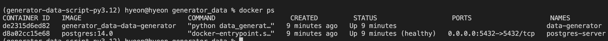
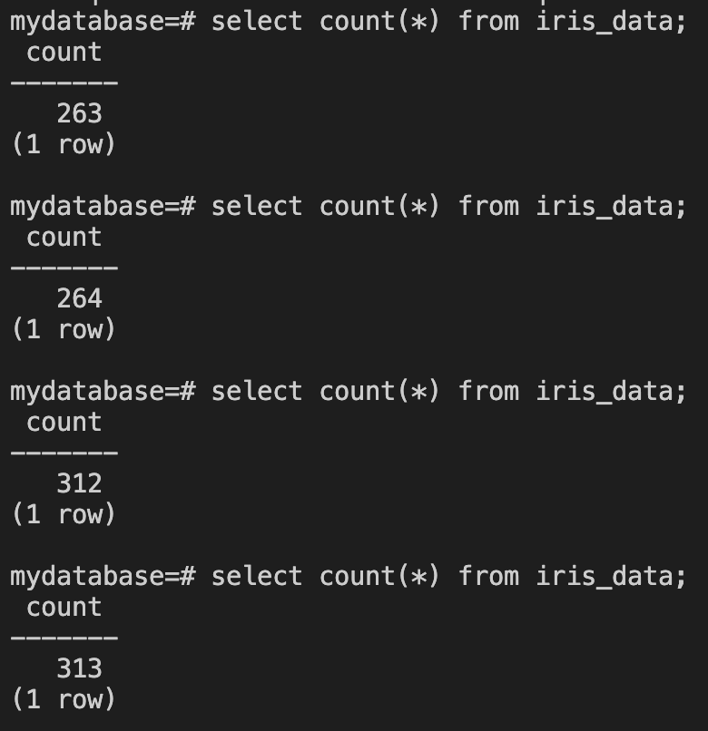
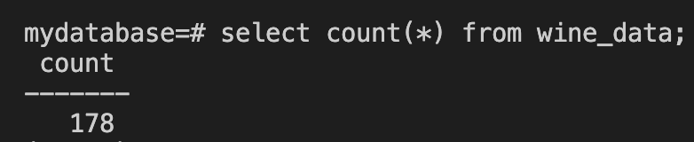
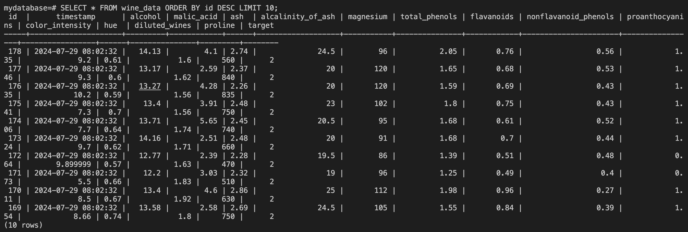

# (공용) postgersql 접속

```sh
PGPASSWORD=mypassword psql -h localhost -p 5432 -U myuser -d mydatabase
PGPASSWORD={.env.postgres.db의 POSTGRES_PASSWORD} psql -h localhost -p 5432 -U {.env.postgres.db의 POSTGRES_USER} -d {.env.postgres.db의 POSTGRES_DB}
```

# (공용) Docker 관련세팅

```sh
docker network create mlops-postgres-network

poetry new generator_data
cd generator_data
rm -r tests
mv generator_data generator_data_script
# mac에선 sed -i 옵션뒤에 항상 파라미터가 필요함 ''
sed -i '' 's/generator-data/generator_data_script/g' pyproject.toml
# 나머지 pyproject.toml 작성 (생략)
poetry add scikit-learn pandas psycopg2-binary
poetry shell
# requirments.txt
poetry export --without-hashes --without-urls -f requirements.txt --output requirements.txt
# 내환경은 3.12.2 버전 이었어서 base 이미지(python:3.9-slim) 에 맞게 scipy 버전을 낮춤 (아래사진첨부)
# requirements.txt 에서 scipy==1.14.0 으로 되어있는거 python 3.9는 지원하지 않아 scipy==1.13.1로 변경
sed -i '' 's/scipy==1.14.0/scipy==1.13.1/g' requirements.txt

# requirements.txt에서 세미콜론(;) 뒤로 지우기
# TODO generator_data_script밑에 4개 파일만들기
# data_generatory.py
# data_generatory2.py
# data_insertion.py # 1개 확인용
# data_insertion_loop.py # 1개씩 무한반복 확인용
# table_creator.py # table 만드는거
# Dockerfile 만들기
# compose 파일만들기

```

scipy 1.14.0 python 버전 requires [scipy 1.14.0](https://pypi.org/project/scipy/1.14.0/)


scipy 1.13.1 python 버전 requires [scipy 1.13.1](https://pypi.org/project/scipy/1.13.1/)


## iris 데이터셋 실행

```sh
# generator_data 경로에서
docker compose -f docker-compose-iris.yaml up -d --build
```

## iris 데이터셋 종료

```sh
# generator_data 경로에서
docker compose -f docker-compose-iris.yaml down
```

### iris(node) 무작위 1개 데이터를 무한반복 실행결과

docker ps 프로세스 확인



1줄씩 랜덤한 sample data insert 확인



# (+Optional) 분석해보고싶은 정형 데이터를 찾아, Database 를 제작해봅시다!

wine 데이터 세트

총 데이터 갯수: **178**

| 컬럼 이름                    | 타입  | 설명                              |
| ---------------------------- | ----- | --------------------------------- |
| alcohol                      | float | 와인의 알코올 함량                |
| malic_acid                   | float | 와인에 포함된 말산 함량           |
| ash                          | float | 와인의 회분 함량                  |
| alcalinity_of_ash            | float | 와인의 회분의 알칼리도            |
| magnesium                    | float | 와인에 포함된 마그네슘 함량       |
| total_phenols                | float | 와인의 총 페놀 함량               |
| flavanoids                   | float | 와인에 포함된 플라보노이드 함량   |
| nonflavanoid_phenols         | float | 와인의 비플라보노이드 페놀 함량   |
| proanthocyanins              | float | 와인에 포함된 프로안토시아닌 함량 |
| color_intensity              | float | 와인의 색상 강도                  |
| hue                          | float | 와인의 색조                       |
| OD280/OD315 of diluted wines | float | 와인의 희석된 OD280/OD315 비율    |
| proline                      | float | 와인에 포함된 프롤린 함량         |
| target                       | int   | 와인 분류(class) 숫자             |

## wine 데이터셋 실행

```sh
# generator_data 경로에서
docker compose -f docker-compose-wine.yaml up -d --build
```

## wine 데이터셋 종료

```sh
# generator_data 경로에서
docker compose -f docker-compose-wine.yaml down
```

### wine 데이터세트 insert many query 실행결과

```sh
select count(*) from wine_data;
```



```sh
# 마지막 10개 조회
SELECT * FROM wine_data ORDER BY id DESC LIMIT 10;
```


