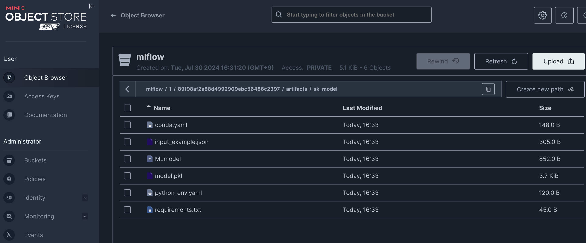
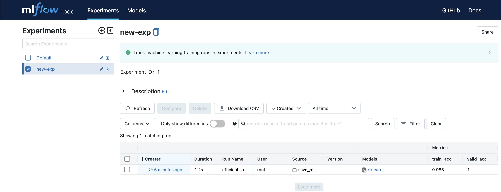
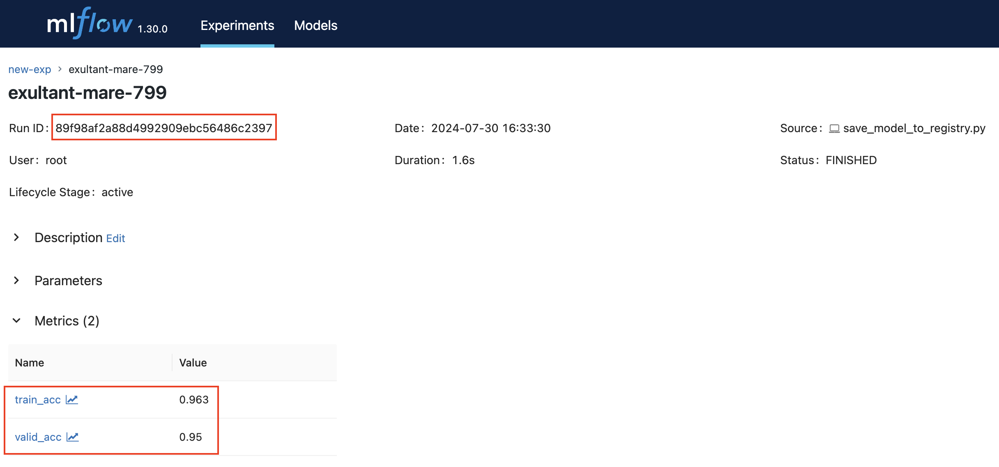
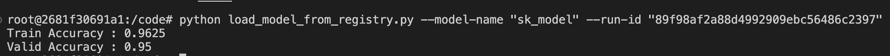

# mlflow와 minio를 사용한 관리

로컬 환경의 python은 12.2 라 실습을 위해 로컬의 python 버전을 3.9로 바꾸진 않고

- docker-compose.yaml
- Dockerfile
- load_model_from_registry.py
- save_model_to_registry.py

파일을 좀 수정해서 container 내부에서 .py 파일들이 실행될 수 있도록 변경 (원본 그대로 실행하면 connection connection refuesed 되어서 docker의 DNS 이용)

---

**minio란 무엇인가?**

minio는 고성능 오브젝트 스토리지 솔루션인 이다. minio는 대규모 데이터 저장과 관리를 위해 Amazon S3 API와 호환되는 오픈 소스 소프트웨어다.

주요 특징

- 고성능
  - minio는 빠른 데이터 접근 속도를 자랑합니다. 이는 대규모 데이터 분석이나 실시간 데이터 처리에 매우 유리합니다.
- 간편한 설치 및 운영

  - 설치 과정이 매우 간단하며, Docker를 통해 손쉽게 배포할 수 있습니다. 운영도 직관적이어서 큰 기술적 부담 없이 사용할 수 있습니다.

- S3 호환 API

  - minio는 Amazon S3 API와 완벽하게 호환됩니다. 따라서 기존에 S3를 사용하던 애플리케이션을 쉽게 통합할 수 있습니다.

- 확장성과 가용성

  - minio는 분산 스토리지 아키텍처를 사용합니다. 이를 통해 데이터를 여러 서버에 분산 저장하여 확장성과 가용성을 높입니다. 서버 하나에 문제가 생겨도 데이터 접근에 문제가 없도록 설계되었습니다.

- 사용 사례
  - 클라우드 네이티브 애플리케이션: 클라우드 환경에서 대규모 데이터를 효율적으로 관리할 수 있습니다. 빅데이터 및 AI/ML 워크로드: 대용량 데이터 처리와 분석에 최적화되어 있습니다. 백업 및 복구: 중요한 데이터의 백업 및 복구를 손쉽게 할 수 있습니다.

---

## 모델을 훈련하고, 저장하기

```sh
# save model
# docker exec -it mlflow-server /bin/bash
python save_model_to_registry.py --model-name "sk_model"
```

minio에 저장된 내용 확인


mlflow에 저장된 내용 확인


## 훈련했던 내용을 불러오기

```sh
# load model
# docker exec -it mlflow-server /bin/bash
python load_model_from_registry.py --model-name "sk_model" --run-id "{RUN_ID}"
# python load_model_from_registry.py --model-name "sk_model" --run-id "89f98af2a88d4992909ebc56486c2397"
```




