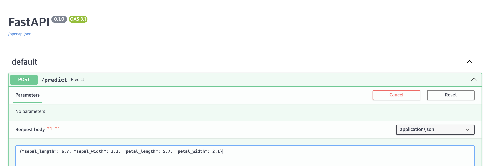

# model api with fastapi

## model api with fastapi을 실행하려면 이전 postgresql 서버, mlfow, minio 서버 등의 dependency가 필요

```sh
make dependency
# dependency 한번에 종료
# make dependency-clean
```

## dependency 실행 후

mlflow 에서 run_id 확인


## 확인한 run id로 model download script 실행

```sh
# 아래명령어들을 모두 part06 경로에서 실행
# localhost:5001 에서 run-id 확인
# 컨테이너 내부에서 download 받게 변경
# docker exec -it api-with-model /bin/bash -c 'python download_model.py --run-id `<RUN-ID>`'
mkdir sk_model
docker compose up -d --build
rm -r sk_model
docker exec -it api-with-model /bin/bash -c 'python download_model.py --run-id 899cbc945253481a83f4536fc2e4da08'
docker cp api-with-model:/usr/app/sk_model .

# compose 내렸다가 다시실행
docker compose down
docker compose up -d --build
```

## swagger 결과 (사진)




### 변경 내용들

로컬 python은 3.12.4 버전이라 docker continaer 내부의 python 3.9 버전에 맞게 실행하려고

로컬 python 에서 실행하는 부분들을 변경

- Makefile의 dependency 부분
  - mlflow server에서 docker exec로 실행하게
    
- download_model.py
  - docker dns를 활용해 localhost로 되어있던 부분을 알맞게 변경
    
- Dockerfile
  - pip install 부분에 추가적인 패키지 추가
  - COPY download_model.py 추가
    
- docker-compose.yaml
  - network 추가
    
